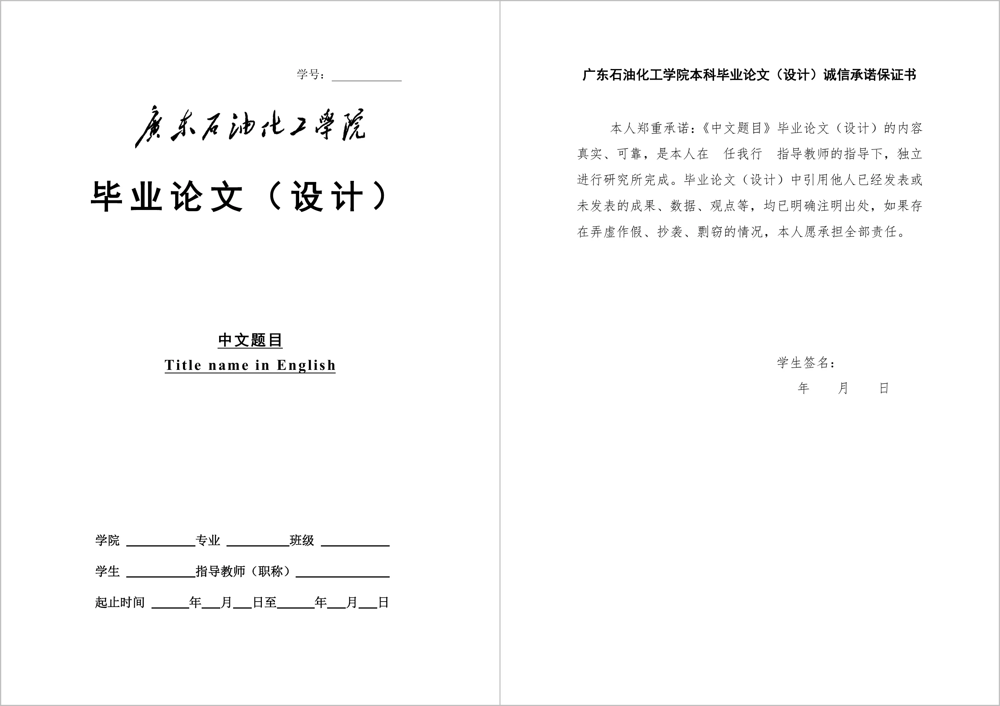
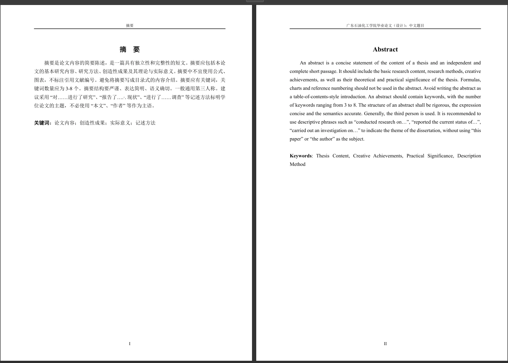
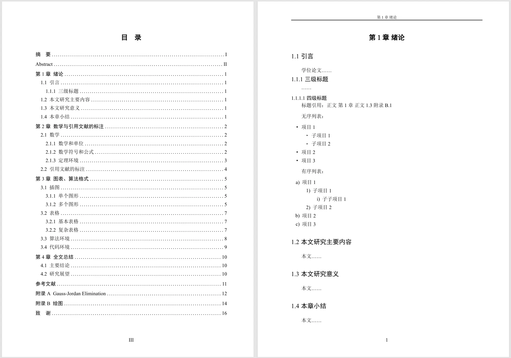

# 广东石油化工学院毕业论文 Typst 模板

一个使用 [Typst](https://typst.app/) 编写的**非官方**广东石油化工学院（Gdupt）毕业论文（设计）模板，能够简洁、快速、持续生成符合学校格式要求的 **PDF 格式** 毕业论文。

<div style="width: 100%; max-width: 800px; margin: 0 auto;">
  
  <details style="margin-top: 10px;">
    <summary style="cursor: pointer; font-weight: bold;">查看更多图片</summary>
    <div style="display: flex; flex-direction: column; gap: 10px; margin-top: 10px;">
    
      
    </div>
  </details>
</div>

## ✨ 特性

- **符合学校规范**：参考 [官方 Word 文档](https://jwb.gdupt.edu.cn/info/1057/10126.htm) 开发，高度对齐学校格式要求
- **现代化排版**：使用 Typst 现代排版系统，编译速度快，语法简洁
- **实时预览**：支持 VS Code 实时编辑和预览
- **完整功能**：包含封面、中英文摘要、目录、图表、公式、参考文献等完整论文组件
- **易于定制**：格式简单，便于根据个人需求调整样式

## 🚀 快速开始

### 第一步：获取模板

1. **获取模板**

   ```bash
   # 克隆本仓库
   git clone https://github.com/hibays/gdupt-thesis-typst.git
   cd gdupt-thesis-typst
   ```

### 第二步：使用 VS Code （推荐）实时编辑论文

1. 安装 [VS Code](https://code.visualstudio.com/)，选择把VSCode注册到右键菜单

2. 安装 [Tinymist Typst](https://marketplace.visualstudio.com/items?itemName=myriad-dreamin.tinymist) 扩展（没错！只需点点鼠标简简单单安装一个插件！）

3. 打开本文件夹，右键选择“在 VS Code 中打开”（即作为工作空间打开）

4. 在 VS Code 中打开 `thesis.typ` 文件
   然后修改封面信息：

   ```typst
     #paper-cover(
       [毕业论文（设计）]      // 大标题
       [你的论文中文题目],     // 中文题目
       [Your English Title],   // 英文题目
       [你的学号],             // 学号
       [你的学院],             // 学院
       [你的专业],             // 专业
       [你的班级],             // 班级
       [你的姓名],             // 学生
       [指导教师姓名],         // 指导教师
       [指导教师职称],         // 职称
       datetime(year: 2025, month: 11, day: 12), // 启动日期
       datetime(year: 2025, month: 12, day: 30), // 结束日期
       显示下划线: true,
       仅显示下划线: false,
       双面打印: false,
     )
     ```

     和摘要信息：

     ```typst
     #paper-up(
         [
            这里是中文摘要内容。
         ],
         [
            这里是英文摘要内容。
         ],
         // 关键词
         中文关键词: ([关键词1], [关键词2], [关键词3], [关键词4], [关键词5]),
         英文关键词: ([kw1], [kw2], [kw3], [kw4], [kw5]),
         尾随空页: false,
         )
     ```

5. 按下 Tab 栏右上角的预览键即可打开实时预览

6. 开始编辑，预览窗口会随键入实时更新，并可以双向跳转

### 或者：使用 Typst CLI 编译本模板

1. **安装 Typst**
   - 访问 [Typst 官网](https://typst.app/) 下载并安装
   - 或使用包管理器安装：

     ```bash
     # macOS (Homebrew)
     brew install typst
     
     # Windows (Scoop)
     scoop install typst
     
     # Linux
     curl -proto '=https' -tlsv1.2 -sSf https://raw.githubusercontent.com/typst/typst/main/install.sh | sh
     ```

2. **编译论文**

   ```sh
   # 编译生成 thesis.pdf
   typst compile thesis.typ

   # 或使用 watch 模式（自动重新编译）
   typst watch thesis.typ
   ```

## 📁 项目结构

```sh
.
├── thesis.typ          # 主论文文件（在此编写内容）
├── fmt-req.typ         # 格式要求和样式定义
├── refs.bib            # 参考文献数据库（BibTeX 格式）
├── assets/             # 图片资源（校徽、题字等）
│   └── header.png      # 学校名书法图片
├── figures/            # 论文图表
│   ├── fig-xxx.png    # 图表 xxx
│   └── ...
└── README.md           # README文件
```

## 📝 模板功能

### 核心组件

- ✅ **封面**：符合学校规范的论文封面
- ✅ **诚信承诺书**：自动生成的诚信承诺保证书
- ✅ **中英文摘要**：支持中英文双语摘要
- ✅ **目录**：自动生成的目录
- ✅ **页眉页脚**：符合学校规范的页眉页脚
- ✅ **参考文献**：支持 BibTeX 格式和文内引用，建议使用Zotero等文献管理软件
- ✅ **附录**：附录章节支持

### 内容元素

- ✅ **表格**：三线表环境，支持续表和脚注
- ✅ **图片**：插图环境，支持子图和双语图题
- ✅ **公式**：完整的数学公式支持
- ✅ **算法**：算法环境，支持跨页自动续
- ✅ **代码**：代码高亮显示
- ✅ **定理证明**：定理和证明环境

### 高级功能

- ✅ **盲审模式**：支持盲审模式，用灰框遮蔽个人信息
- ✅ **双面打印**：支持双面打印模式，可以得到和官方模板一样的打印样式

## 🎨 字体设置

模板默认使用 Windows 系统字体。如需修改字体：

1. 查看系统可用字体：

   ```bash
   typst fonts
   ```

2. 编辑 `fmt-req.typ` 文件，修改字体配置：

   ```typst
   // 在文件开头找到字体定义
   #let TimeSimSun = ("Times New Roman", "SimSun")
   #let TimeSimHei = ("Times New Roman", "SimHei")
   ```

See: [如何设置（中文）字体？](https://typst.dev/guide/FAQ/install-fonts.html)和[为什么代码块里面的中文字体显示不正常？](https://typst.dev/guide/FAQ/chinese-in-raw.html)

## 😶‍🌫️ TODO & Known Issues

|优先级|类型|项目|
|-|-|-|
|HIGH|IMPL|双面打印模式实现不正确|
|MEDIUM|FUNC|加入插图和附表清单|
|MEDIUM|FUNC|加入附号、标志、缩略词、首字母缩写、术语等汇集表|
|LOW|IMPL|边框表格续表不正确|

## 📚 学习资源

### Typst 入门

- [Typst 官方文档](https://typst.app/docs/)
- [Typst 中文文档](https://typst-doc-cn.github.io/)
- [面向 Word 用户的快速入门](https://typst.dev/guide/word.html)（推荐看这个）
- [Typst 中文 FAQ](https://typst.dev/guide/FAQ.html)
  - [如何修改公式里的中文字体？](https://typst.dev/guide/FAQ/equation-chinese-font.html)
  - [怎么把 cal 字体变成 LaTeX 里 mathcal 默认的那种？](https://typst.dev/guide/FAQ/mathcal_font.html)
  - [如何让几个汉字占固定宽度并均匀分布？](https://typst.dev/guide/FAQ/character-intersperse.html)
  - [中英文下划线错位了怎么办？](https://typst.dev/guide/FAQ/underline-misplace.html)
  - [为什么下划线不显示？](https://typst.dev/guide/FAQ/underline-not-display.html)

### 数学公式

- [《本科生 LaTeX 数学》的 Typst 中文版](https://github.com/tzhtaylor/typst-undergradmath-zh)

### 第三方包

- [Typst Universe](https://typst.app/universe) - Typst 包和模板库

## ❓ 常见问题

### Q: 我不会 LaTeX/编程，能用这个模板吗？

**A:** 完全可以！Typst 语法类似 Markdown，非常容易上手。你只需要按照模板中的示例填写内容即可。

### Q: 文科生能用这个模板吗？

**A:** 当然可以！简单借助VSCode和Tinymist扩展，你可以实时预览论文效果，鼠标点击预览窗口相应文字即可定位到typ源码对应位置，无需配置复杂环境。

### Q: 为什么只有一个 thesis.typ 文件？

**A:** Typst 编译速度极快，单个文件便于管理和同步。通过 VS Code 的实时预览功能，可以轻松定位和编辑内容。

### Q: AI或者智能体能写Typst论文吗？

**A:** 行！不过最好借助[Typst 语法作者技能](https://github.com/typst-doc-cn/tutorial/blob/main/.codex/skills/typst-grammar-authoring/SKILL.md)这个Skill，手动把他输入到Prompt或安装到Claude Code/Codex/OpenClaw等智能体中，这样可以减少点语法错误。

### Q: 如何添加参考文献？

**A:** 在 `refs.bib` 文件中添加 BibTeX 格式的参考文献，然后在正文中使用 `@citation-key` 引用。

### Q: 如何添加图片？

**A:** 将图片放入 `figures/` 目录，然后在正文中使用：

```typst
#imagex("figures/your-image.png", width: 80%)
```

### Q: 编译时出现字体错误怎么办？

**A:** 确保系统中安装了所需的中文字体（宋体、黑体、Times New Roman），或修改 `fmt-req.typ` 中的字体配置。

**PS:** 如果你使用WSL2，可以参考[这个](https://blog.csdn.net/oZuoZuoZuoShi/article/details/118977701)直接使用宿主机的字体：`sudo ln -s /mnt/c/Windows/Fonts /usr/share/fonts/font && sudo fc-cache -fv`

## 🤝 贡献

欢迎提交 Issue 和 Pull Request 来改进这个模板！

## 🙏 致谢

本模板基于以下优秀项目开发：

- [modern-sjtu-thesis](https://github.com/sjtug/modern-sjtu-thesis) - 上海交通大学 Typst 论文模板
- [modern-nju-thesis](https://github.com/nju-lug/modern-nju-thesis) - 南京大学 Typst 论文模板
- [Typst 中文社区](https://typst-doc-cn.github.io/) - 提供中文文档和疑难解答支持
- [小红书上的毕业论文模板](https://www.xiaohongshu.com/explore/69a1792d000000002202ef79?xsec_token=AB5LjaTLAU7_mODiEvcdiDgMm1CfJG_gyJDyKjrzckKK0=&xsec_source=pc_search&source=web_search_result_notes) - 提供毕业论文格式的参考

## 📄 许可证

[MIT License](LICENSE)
